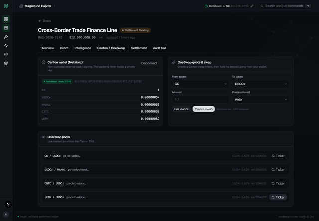
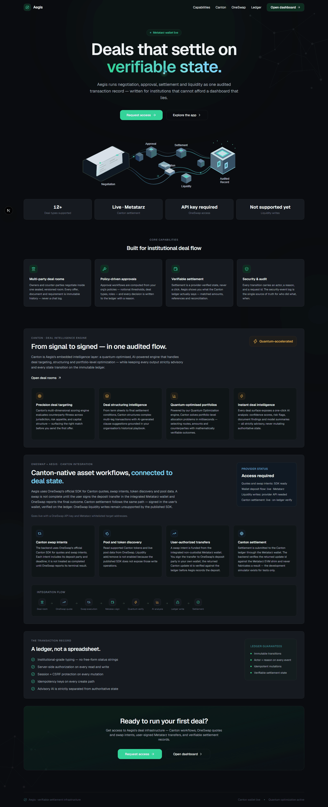
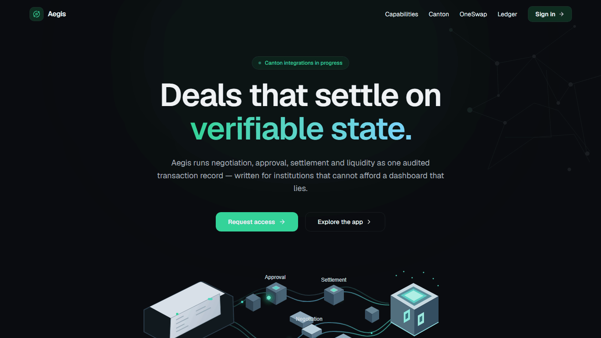
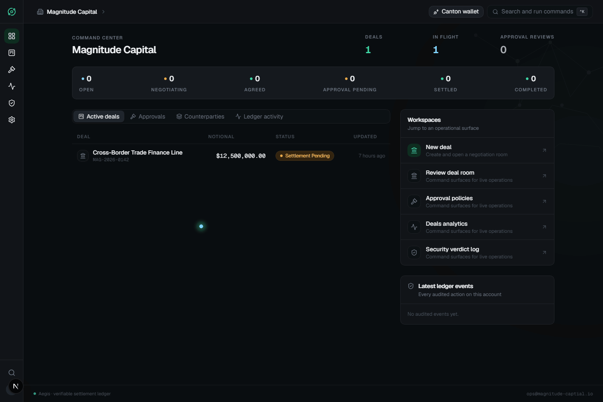
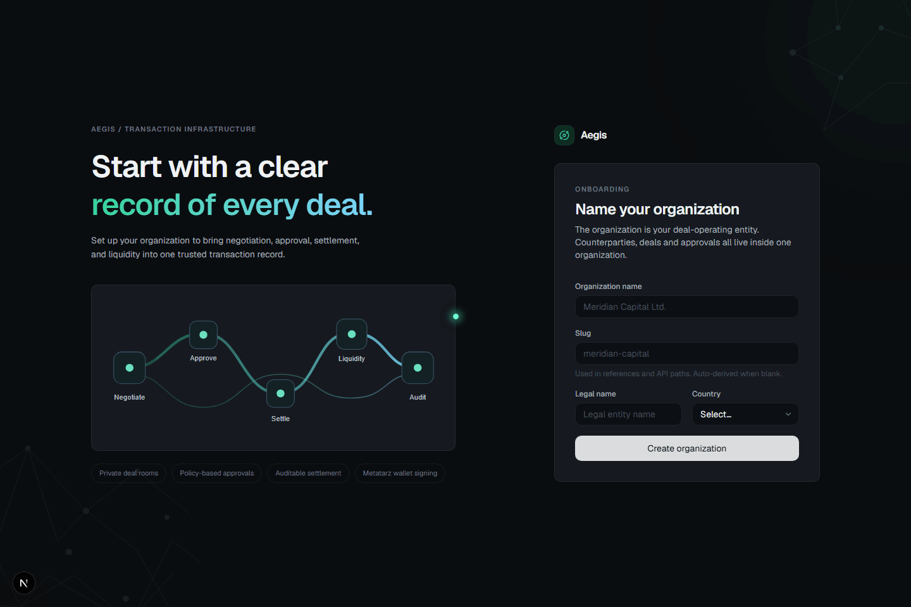

# Aegis

<p align="center">
  
</p>

<h3 align="center">Move high-stakes deals forward. Keep every decision accountable.</h3>

<p align="center">
  Aegis is an institutional deal workspace for private negotiation, policy-driven approvals, settlement workflows, liquidity operations, and a traceable transaction history. It brings the work between a first offer and a verified outcome into one permissioned system.
</p>

<p align="center">
  
  
  
  
  
  
  <a href="https://github.com/opeblow/AEGIS/actions/workflows/ci.yml"></a>
  <a href="LICENSE"></a>
</p>

<p align="center"><a href="CONTRIBUTING.md">Contributing</a> · <a href="CODE_OF_CONDUCT.md">Code of Conduct</a> · <a href="SECURITY.md">Security</a></p>

<p align="center"><em>One transaction record. From first offer to verified outcome.</em></p>

<p align="center">
  <strong>Metatarz wallet</strong> — non-custodial Canton signing for OneSwap funding and settlement. Aegis never holds your key.
</p>
<p align="center">
  
</p>

## Table of contents

- [Product tour](#product-tour)
- [What Aegis does](#what-aegis-does)
- [Canton deal intelligence](#canton-deal-intelligence)
- [OneSwap and liquidity integration](#oneswap-and-liquidity-integration)
- [Architecture at a glance](#architecture-at-a-glance)
- [Project structure](#project-structure)
- [Data integrity and idempotency](#data-integrity-and-idempotency)
- [Production-scale system design](#production-scale-system-design)
- [Requirements](#requirements)
- [Run locally](#run-locally)
- [Configuration](#configuration)
- [Verification](#verification)
- [Production readiness](#production-readiness)
- [GitHub automation](#github-automation)
- [Contributing and security](#contributing-and-security)
- [License](#license)

## Product tour

Aegis carries one visual language from the landing page into sign-in, account creation, and onboarding: a dark canvas, faint network geometry around the edges, emerald-to-steel highlights, and a transaction-flow illustration. On wide screens the artwork supports the main task; on mobile the form stays readable and the decoration moves behind the content.

### Landing page


### Deal flow


### Canton wallet


### Sign in


### Account creation


### Organization onboarding


## What Aegis does

- **Negotiation:** private deal rooms, versioned offers, counteroffers, participants, documents, and requirements.
- **Approvals:** organization permissions and approval workflows record decisions and state changes.
- **Canton deal intelligence:** Aegis assembles an authorized deal context and requests advisory analysis or question answering. Results are versioned records; they do not approve or change a deal.
- **Route optimization:** compare candidate settlement routes against explicit constraints. The local solver is a simulator, not quantum hardware.
- **Settlement and reconciliation:** track settlement requests and reconcile provider status with deal state.
- **OneSwap on Canton:** the backend now uses OneSwap's official TypeScript SDK for quotes, swap intents, swap status, pool details, and token/pool discovery. A swap intent still requires a user-authorized Canton transfer to its returned deposit party.
- **Audit and access:** organization-scoped authorization, participant checks, CSRF protections for browser mutations, and security events for sensitive actions.

The backend is authoritative for accounts, organizations, deal state, and persisted workflow records. Intelligence, route recommendations, and provider quotes are advisory inputs. Aegis does not treat a model response or quote as an approval.

## Canton deal intelligence

The product calls its deal-intelligence experience **Canton**. In the repository, that experience is implemented by the backend AI module and the internal `ai-ml/` FastAPI service:

1. An authenticated user requests an analysis or asks a question about a deal.
2. The API resolves the deal participant and organization permissions, then builds a scoped context from authorized records.
3. The backend calls the private AI service, validates the response shape and deal identity, and stores analysis runs with status, model metadata, and a context hash.
4. The UI presents the result as guidance. Deal changes still require the relevant workflow action and permission.

The current model provider defaults to `mock` (`aegis-mock-v1`) so local development and CI do not depend on a hosted model. Configure and validate a supported hosted provider before describing model-backed Canton analysis as production-enabled. The landing page also describes counterparty matching and playbook-grounded clause suggestions; those are product direction, not a claim that every such capability is implemented in the current service.

## OneSwap and liquidity integration

The backend exposes authenticated, deal-scoped routes for OneSwap quotes, swap execution/status, pool information, and liquidity add/remove. Read operations require the organization read permission; operations that can initiate an external action require the `oneswap:execute` permission. Mutating browser calls also pass the backend's CSRF/origin protections. The service records security events with the deal, actor, request correlation, and operation details.

`getOneSwapClient()` uses the official `@oneswap/sdk`; it never falls back to a mock. The API key stays on the backend. The published SDK supports quotes, swap intents/status, cancel, token discovery, pool reads, and pool tickers. It does not expose liquidity add/remove operations; those routes return `501` instead of inventing a provider response. OneSwap API access is not configured in this repository (see [Configuration](#configuration)).

**Canton wallet deposit flow (Metatarz).** Users fund swaps and pay settlement from the integrated non-custodial Metatarz wallet (EIP-1193/EIP-6963, detected like MetaMask). The browser signs CC/CIP-56 transfers against an external-party `depositParty` and returns a Canton `update_id`; the backend verifies that update id against the Metatarz EVM shim (`eth_getTransactionReceipt`) before recording the deposit (`POST /oneswap/swap/:swapId/deposit`). The backend never holds a private key. Deposit destination addresses must be whitelisted in Metatarz, and OneSwap must observer the deposit on-chain before finalizing the swap.

Swap writes persist a tenant/deal/user-scoped operation record and bind the client idempotency key to a request hash. Aegis can recover a provider-accepted open intent using OneSwap's stable user reference and rejects mismatched retries. Verify OneSwap's concurrency/idempotency contract and add focused replay, mismatch, timeout, and provider callback tests before irreversible production use. See [Production readiness](#production-readiness) and the [system design](docs/architecture.md).

## Architecture at a glance

```text
Browser ──> Next.js web app ──> Fastify API ──> PostgreSQL
                                      ├──────> AI advisory service (FastAPI)
                                      ├──────> route optimization service (FastAPI)
                                      └──────> OneSwap provider adapter
```

The API enforces authentication, participant confidentiality, and organization permissions. Python services are internal dependencies called by the backend. The local architecture does not itself prove high availability or million-user capacity; the deployment controls and load evidence needed for those claims are described in [docs/architecture.md](docs/architecture.md).

## Project structure

```text
AEGIS/
├── .github/workflows/       CI checks and tagged GitHub releases
├── ai-ml/                   FastAPI deal intelligence service
│   ├── app/                 API, schemas, pipelines, and analysis services
│   └── tests/
├── backend/                 Fastify API and Prisma data layer
│   ├── prisma/              Schema, migrations, and seed data
│   ├── src/modules/         Auth, deals, approvals, documents, settlement,
│   │                        AI, optimization, and OneSwap adapters
│   └── tests/               Unit and integration tests
├── docs/
│   ├── architecture.md      Production-scale system design and readiness
│   └── media/               Product screenshots and animated GIFs
├── frontend/                Next.js web application
│   ├── public/
│   └── src/                 App routes, components, and shared libraries
├── quantum computing/       FastAPI route-optimization service
│   ├── app/                 Optimization models, solvers, and API
│   └── tests/
├── CODE_OF_CONDUCT.md
├── CONTRIBUTING.md
├── LICENSE
├── README.md
└── SECURITY.md
```

## Data integrity and idempotency

Idempotency is a property of each operation, not a blanket guarantee that every endpoint can be retried safely.

- Deal, offer, document, requirement, and settlement creation paths use hashed idempotency keys and payload fingerprints in relevant flows. Unique database constraints make the key scope durable; a reused key with a different payload is a conflict.
- State transitions use version checks and unique transition request identifiers to reject stale or duplicate transitions.
- Canton analysis hashes a canonical authorized context and can replay a completed matching result. The current implementation can still create duplicate pending runs under concurrent identical requests because there is no unique constraint on the input hash.
- OneSwap write correlation IDs are currently recorded for audit; they do not yet provide exactly-once provider execution. Use the safeguards described above before retrying provider mutations automatically.

No distributed system can promise exactly-once execution across Aegis, a network, and an independent provider without cooperation from the provider. A production implementation should make commands idempotent, record state durably, and reconcile external outcomes.

## Production-scale system design

The design goal is to grow to millions of registered users without relying on a single API process or database connection pool. Registered-user count alone is not a capacity measure: the team must establish active-user, burst, read/write mix, payload, provider-latency, and geographic assumptions, then size and load-test against them. The detailed architecture, failure behavior, security controls, capacity method, and rollout plan are in [docs/architecture.md](docs/architecture.md).

Core design rules:

1. Keep API instances stateless and horizontally scalable; keep transaction state in PostgreSQL.
2. Bound every dependency with timeouts, concurrency limits, backpressure, and explicit degraded behavior.
3. Use database constraints and transactions as the final guard against duplicate state changes.
4. Treat external provider calls as distributed workflows: durable operation records, idempotency, reconciliation, and auditable state transitions.
5. Separate user-facing reads from long-running analysis and provider work with durable queues when latency or throughput requires it.
6. Measure service-level indicators and prove recovery with load, restore, and failure-injection exercises before production claims.

## Requirements

- Node.js 24 (the CI workflow currently pins Node 24) and npm
- Python 3.12
- PostgreSQL 15 or newer (CI currently uses PostgreSQL 17)

## Run locally

Create a Python virtual environment from the repository root and install both service dependencies:

```powershell
python -m venv venv
.\venv\Scripts\python.exe -m pip install -r ai-ml\requirements.txt
.\venv\Scripts\python.exe -m pip install -r "quantum computing\requirements.txt"
```

Start PostgreSQL and create the application and test databases:

```sql
CREATE DATABASE aegis;
CREATE DATABASE aegis_test;
```

Configure and migrate the backend:

```powershell
cd backend
Copy-Item .env.example .env
# Set DATABASE_URL to the aegis database and AEGIS_TEST_DATABASE_URL to aegis_test.
npm install
npm run db:generate
npm run db:migrate
npm run db:seed
```

Run each process in a separate terminal:

```powershell
cd ai-ml
..\venv\Scripts\python.exe -m uvicorn app.api.app:app --host 127.0.0.1 --port 8555
```

```powershell
cd "quantum computing"
..\venv\Scripts\python.exe -m uvicorn app.api.app:app --host 127.0.0.1 --port 8557
```

```powershell
cd backend
npm run dev
```

```powershell
cd frontend
npm install
npm run dev
```

Open [http://localhost:3000](http://localhost:3000). The API listens on port `4000`; internal Python services use `8555` and `8557`. The frontend needs the backend URL configured as described in `frontend/.env.example`.

## Configuration

Use the checked-in `.env.example` files as the configuration reference. At minimum, set backend database URLs, session/auth secrets, allowed frontend origins, and both internal service URLs. The integration test setup requires `DATABASE_URL`, `AEGIS_TEST_DATABASE_URL`, `AI_SERVICE_URL`, and `QUANTUM_SERVICE_URL`; CI defines all four explicitly.

For OneSwap, configure `ONESWAP_API_KEY` and `ONESWAP_ENVIRONMENT=devnet` for development (`mainnet` is required in production). Obtain the key from OneSwap and keep it in the deployment secret manager.

For Canton settlement and OneSwap deposit funding, set `SETTLEMENT_PROVIDER=canton`. Users pay through the non-custodial Metatarz wallet: connect in the app shell (or the Canton/OneSwap deal tab), whitelist the site and the recipient party addresses in Metatarz, then execute transfers. The backend verifies each returned `update_id` against the public Metatarz EVM shim before settling (`eth_getTransactionReceipt`). RPC target and timeouts are configurable via `METATARZ_RPC_URL`, `METATARZ_CHAIN_ID`, and `METATARZ_TIMEOUT_MS` (defaults: the Canton testnet shim at `https://canton-testnet.rpc.wallet.metatarz.xyz`, chain `30337`, 15 s). The mock provider is development-only and firmly refused in production. OneSwap liquidity add/remove routes return `501` — the published SDK does not expose those operations. Never point `npm run db:test:setup` at a development or production database: it force-resets the configured test database.

## Verification

From `frontend/`:

```powershell
npm ci
npm run lint
npx tsc --noEmit
npm run build
```

From `backend/` with PostgreSQL available and environment configured:

```powershell
npm ci
npm run db:test:setup
npm test -- --no-file-parallelism
npm run typecheck
npm run lint
npm run build
```

The database setup command **must run in `backend/`**. It force-resets `AEGIS_TEST_DATABASE_URL`; use a dedicated disposable `aegis_test` database. The GitHub Actions backend job sets both required service URLs (`AI_SERVICE_URL` and `QUANTUM_SERVICE_URL`) and runs the setup step with `working-directory: backend`. Therefore the failure linked to commit `6bee970` is from an earlier workflow revision; inspect the newest run on `main` for the current result.

From each Python service directory, run its test suite with the repository virtual environment:

```powershell
..\venv\Scripts\python.exe -m pytest -q
```

## Production readiness

The repository contains CI checks and provider adapters, but neither live Canton settlement on a real network nor the OneSwap API is configured/verified against live infrastructure. That is not evidence of production readiness or capacity for millions of users. Before production traffic or irreversible provider operations, close and verify at least these items:

- Configure a real, supported AI model provider; test privacy, retention, output quality, cost ceilings, and failure modes.
- Verify Canton settlement on a live Canton network: whitelisting, the external-party signing model, the `update_id` verification path against the Metatarz EVM shim, and sender/receiver party mapping under load and failure. The current adapter is non-custodial (backend never holds a key) but shares the Metatarz testnet assumptions described in [Configuration](#configuration).
- Obtain OneSwap integration access and verify provider idempotency, terminal-state reconciliation, and the meaning of the `deposit_detected` status end-to-end once a wallet-funded deposit lands on-chain. Continue to treat liquidity add/remove as unsupported until the published SDK exposes them.
- Add durable async work handling (queue plus transactional outbox/inbox) for long-running or retryable external operations.
- Deploy PostgreSQL with managed high availability, tested point-in-time recovery, bounded connection pooling, migration rollback/forward procedures, and documented RPO/RTO.
- Configure distributed rate limits and abuse controls appropriate to a multi-instance deployment; the current API security plugin uses an in-process Fastify limiter by default.
- Instrument API, database, Python services, and provider calls with correlated metrics, logs, traces, actionable alerts, and an on-call/runbook process.
- Establish workload assumptions and service-level objectives, then test peak load, dependency slowdown, database failover, queue backlog, backup restoration, and regional recovery.
- Review secrets management, encryption, data retention/deletion, access reviews, supply-chain controls, and incident response for the target environment.

See [docs/architecture.md](docs/architecture.md) for staged implementation guidance and concrete reliability patterns.

## GitHub automation

GitHub Actions runs frontend lint, type checking, and production build; backend tests, type checking, lint, and build against a dedicated PostgreSQL test database; and both Python service test suites. The workflow sets `AI_SERVICE_URL` and `QUANTUM_SERVICE_URL` for backend checks because the backend validates those URLs even when the tests use mocks. Pushing a version tag such as `v1.0.0` runs the same checks and, if all pass, publishes a GitHub Release with a source archive.

## Contributing and security

Read [CONTRIBUTING.md](CONTRIBUTING.md) before opening a change. Follow the [Code of Conduct](CODE_OF_CONDUCT.md). Report security issues privately using the process in [SECURITY.md](SECURITY.md); do not publish exploitable details in a public issue.

## License

This project is licensed under the [MIT License](LICENSE). Copyright © 2026 Mobolaji Opeyemi Bolatito.
