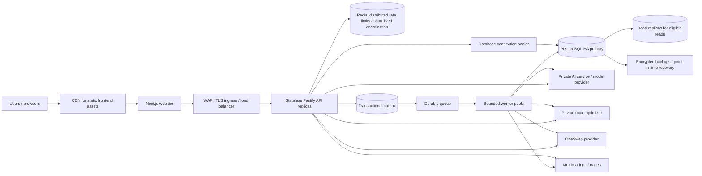

# Aegis production-scale architecture

This document separates **what the repository implements today** from the **deployment design required for dependable high-volume production**. A diagram or recommendation below is not evidence that infrastructure is already deployed, capacity has been measured, or a service-level objective has been achieved.

## 1. Goals and operating assumptions

Aegis handles multi-organization deal data and coordinates changes across a relational database and external services. The architecture should preserve tenant boundaries, keep the database authoritative, make retries safe, and degrade predictably when advisory or provider services are unavailable.

“Millions of users” should be translated into measurable workload before capacity is promised. Registered accounts do not determine throughput. Define active users by time interval, concurrent sessions, requests per session, peak-to-average ratio, read/write mix, largest organization, payload sizes, transaction rate, provider latency, and geographic distribution. Load-test that model against the exact production topology and service limits.

## 2. Current system and target deployment

### Current repository components

| Component | Current responsibility | Important limit |
|---|---|---|
| Next.js frontend | Browser UI, onboarding, deal workflows | Requires a separately deployed API and correctly configured browser origin. |
| Fastify/Prisma backend | Authentication, authorization, transaction state, workflows, API integrations | One API process is not a high-availability deployment. Global rate limiting currently uses the process-local Fastify plugin store by default. |
| PostgreSQL | Authoritative application records and constraints | Repository schema alone does not configure managed HA, backups, failover, or connection pooling. |
| `ai-ml/` FastAPI | Advisory deal analysis and questions | The configured model provider defaults to `mock`; long-running work is currently synchronous at the API boundary. |
| `quantum computing/` FastAPI | Route optimization | A local simulator is not quantum hardware. Keep this service advisory to authoritative deal state. |
| OneSwap adapter | Quote, swap, pool, and liquidity provider calls | A mock adapter is selected unless both provider URL and key are configured. Current write request IDs are audit correlation, not durable idempotency. |

### Recommended production topology



The direct API-to-service arrows represent the current synchronous paths. The outbox, durable queue, dedicated worker pools, Redis, database replicas, and operational services are recommended target components and may require implementation and deployment work. Do not put internal services or the database on a public network. Expose only the required web/API ingress.

Start with one write region and a highly available database deployment. Add read replicas only for queries whose consistency requirements permit replica lag. Multi-region active-active writes introduce conflict, ordering, and failover complexity; adopt them only after the product's recovery objectives and consistency model require them.

## 3. Main request flows

### Authoritative deal mutation

1. The browser sends an authenticated request with a CSRF token for cookie-authenticated mutation and an idempotency key for supported create/command endpoints.
2. The API authenticates the actor, resolves deal participation, checks organization permission, validates the payload, and applies tenant scope to database queries.
3. A database transaction checks idempotency and expected entity version, writes the business state and transition/audit record, then commits.
4. The API returns the committed state and request identifier. If asynchronous side effects are needed, it records an outbox row in the same transaction; a worker publishes it after commit.

The transactional outbox is a target pattern. It prevents the classic dual-write failure where the database commits but a separate queue publish is lost, or a message publishes for a transaction that later rolls back.

### Cannon / deal intelligence

Today the backend builds an authorized context, hashes a canonical representation, calls the AI service synchronously, validates its response, and records a `PENDING` then `COMPLETED` or `FAILED` run. Matching completed contexts can be replayed. Identical requests racing before either creates a pending row can still create duplicate work; the schema has an index but no unique input-hash constraint.

At higher scale, create a durable analysis job and return a run identifier promptly. Workers should enforce per-organization quotas, bounded concurrency, context-size limits, provider timeouts, cost budgets, and cancellation. Store model/provider version and input fingerprint for auditability; minimize sensitive context sent to a hosted provider. AI output remains advisory and must never bypass application authorization or state-transition rules.

### OneSwap mutation

Today the API validates and authorizes a swap/liquidity request, calls the provider, then records a security event containing the returned reference and request correlation. If the provider accepts an operation but the response is lost, an automatic retry can repeat the mutation; if audit persistence fails after provider acceptance, the response path can also be ambiguous.

For production writes, persist a command before dispatch with a unique key scoped to tenant, operation, and client idempotency key. Store a canonical payload hash and reject same-key/different-payload requests. A worker dispatches with the same stable provider idempotency key, persists provider references and transitions, and reconciles provider webhooks or polling. Authenticate and deduplicate webhooks. If the provider lacks idempotency, query/reconcile by a stable operation reference before any retry and move ambiguous operations to manual review rather than risking a duplicate. Never infer finality merely from “request accepted.”

## 4. Tenancy, authorization, and data integrity

- Derive organization and participant scope from the authenticated identity and authorized records, not from untrusted request fields alone.
- Keep authorization checks in the API for every object lookup and mutation; use database constraints to enforce uniqueness and valid relationships as a second line of defense.
- Use short transactions for state changes. Do not hold a database transaction open while calling an AI or payment/liquidity provider.
- Use optimistic version checks for concurrent edits and explicit state machines for offers, deals, documents, settlement, and provider operations.
- Preserve stable request identifiers across logs, API responses, traces, and worker messages. Do not log credentials, session tokens, full sensitive documents, or unnecessary model prompts.
- Store idempotency key hashes rather than raw secrets. Bind the key to a canonical payload hash, authenticated actor/tenant, and operation scope; define key retention to exceed the maximum retry window.
- Treat audit history as tamper-evident operational evidence only to the extent the storage and administrative controls prove it. A database event row is not cryptographic immutability by itself.

### Idempotency coverage today

Some deal, offer, document, requirement, settlement, and transition paths already use key hashes, payload hashes, uniqueness constraints, or request/version guards. The exact guarantees differ by endpoint. Cannon reuses completed analyses but has the concurrent pending-run limitation above. OneSwap mutations do not yet have durable end-to-end idempotency. Maintain an operation-by-operation idempotency table in API documentation and add tests for same-key replay, mismatched payload, concurrent duplicate delivery, timeout after provider acceptance, and webhook redelivery.

## 5. Capacity and scaling approach

Use measurements rather than a target user count to size infrastructure:

```text
peak API requests/second = active users in peak window × requests per user per second
peak database demand     = API request mix × queries per request + background worker queries
required service capacity = measured peak × headroom validated by load tests
```

Record assumptions and confidence intervals. Include bursts from imports, onboarding, scheduled work, and provider callbacks. Test both steady load and sudden ramps; a test that only measures cached reads cannot establish write-path capacity.

Recommended scaling sequence:

1. Measure API latency by route, database query time/pool wait, event-loop saturation, external dependency latency, and queue age.
2. Optimize indexes and query shapes; paginate large collections and enforce payload and page-size limits.
3. Run multiple stateless API replicas behind ingress. Set per-instance pool limits so the sum of all API and worker connections remains below the database budget; use a pooler where appropriate.
4. Move expensive/variable work to durable queues. Scale worker pools independently and cap provider concurrency, retries, and per-tenant usage.
5. Add Redis or another shared store for distributed rate limits and ephemeral coordination. The current process-local limiter cannot enforce a single global quota across replicas.
6. Add read replicas only for measured read pressure and explicitly tolerate their lag. Keep authorization-sensitive and immediate read-after-write flows on the primary unless consistency is otherwise guaranteed.
7. Partition or archive high-volume history tables only after retention, query, and restore behavior are defined and measured.

Cache public immutable assets at the CDN. Cache private deal data only with tenant-aware keys, short expiration, explicit invalidation, and a documented consistency model. Never use a cache as the source of truth for balances, approvals, or settlement state.

## 6. Reliability, timeouts, and failure policy

- Set explicit connect, request, and total deadlines for every network dependency. Propagate cancellation and enforce payload limits.
- Retry only transient errors, with bounded exponential backoff, jitter, retry budgets, and the same idempotency key. Do not blindly retry non-idempotent provider writes.
- Apply circuit breakers and bulkheads around slow providers so their failure does not exhaust API capacity. These should be added and tuned from observed behavior; a timeout alone is not a circuit breaker.
- Use queue backpressure and per-tenant quotas. Reject or defer excess work clearly rather than growing unbounded in-memory promises.
- Keep health checks separate: liveness answers whether a process should restart; readiness answers whether it can serve its role. Avoid making every liveness probe fail because an optional advisory service is down.
- Define explicit states for `accepted`, `submitted`, `confirmed`, `failed`, and `unknown/reconciliation required` where providers expose asynchronous finality.
- Make schema changes through expand/migrate/contract deployments so old and new application versions can coexist during rollout. Back up before destructive migrations and keep rollback/forward procedures.

Agree initial SLOs with product and operations before publishing them. Candidate indicators include API availability and latency by route class, mutation error rate, queue age, database saturation, provider completion latency, and successful restore time. Set RPO/RTO from business impact, then prove them with point-in-time recovery and failover drills; do not claim recovery objectives until measured.

## 7. Observability and operations

Instrument the browser, API, workers, Python services, database, and provider adapters with correlated request/trace IDs. Emit structured logs with operation and tenant-safe identifiers; metrics should use bounded-cardinality labels (never user IDs or raw deal IDs). Track at least:

- request count, latency percentiles, status/error class, and saturation per route;
- database pool wait, connection count, slow queries, lock time, replication lag, and storage growth;
- queue depth and oldest-message age, retries, dead-letter count, and worker utilization;
- AI/optimizer/provider latency, timeout/error rates, rate-limit responses, operation age, and reconciliation backlog;
- authentication failures, authorization denials, unusual request patterns, and audit-write failures.

Alert on user-impacting symptoms and exhausted recovery capacity, not every transient exception. Maintain runbooks for database failover, provider outage, queue poison messages, credential rotation, suspected tenant data exposure, restore, and rollback. Assign an on-call owner before production launch.

## 8. Security and privacy controls

- Terminate TLS at a managed ingress; use private networking and service authentication for backend-to-service calls.
- Keep production secrets in a secret manager with least privilege, rotation, access audit, and separate environments. Never embed provider keys in frontend bundles.
- Enforce secure session cookies, CSRF checks for browser mutations, explicit production CORS origins, rate limits, request validation, and tenant/participant authorization.
- Encrypt database storage, backups, object storage, and service traffic. Define data classification, retention, deletion, legal hold, and hosted-model data handling before enabling real deal content.
- Restrict database roles and migrations; audit privileged access. Use dependency scanning, pinned/reviewed actions, artifact provenance, and protected release permissions.
- Practice incident response and credential revocation. Security events need access controls and retention policy; they may themselves contain sensitive metadata.

## 9. Deployment and recovery checklist

1. Provision separate development, staging, and production accounts, networks, databases, and secrets.
2. Deploy versioned immutable artifacts; run CI, migration compatibility checks, and staging smoke tests before rollout.
3. Use gradual rollout with health-based rollback; observe error and latency changes during the rollout window.
4. Verify backup encryption and retention; restore into an isolated environment and reconcile record counts and application invariants.
5. Exercise database failover, service outage, queue retry/dead-letter recovery, provider ambiguity, secret rotation, and application rollback.
6. Record runbooks, escalation contacts, service ownership, dashboards, and approved SLO/RPO/RTO values.
7. Run capacity tests with representative data and the expected external-service behavior; publish the tested envelope and known limits.

## 10. Readiness gaps to close in this repository/deployment

The following must be implemented, configured, or evidenced before claiming production-scale reliability:

- durable OneSwap operation/idempotency records and provider outcome reconciliation;
- transactional outbox and durable queue for external and long-running work where required;
- concurrency-safe deduplication of Cannon analysis jobs, plus a production model/provider configuration and privacy review;
- shared distributed rate limiting for multi-replica API deployments;
- deployed PostgreSQL high availability, connection budgeting, backups, point-in-time recovery, and restore/failover evidence;
- production metrics, traces, alert policies, operational runbooks, and on-call ownership;
- measured capacity and resilience results for the declared workload, including tenant isolation under load;
- verified provider contract, wallet authorization boundaries, transaction status/finality semantics, and webhook security.

These gaps are an explicit engineering backlog, not a reason to overstate the current implementation. Close them in independently deployable steps, with schema and API compatibility, failure tests, and operational evidence attached to each change.
