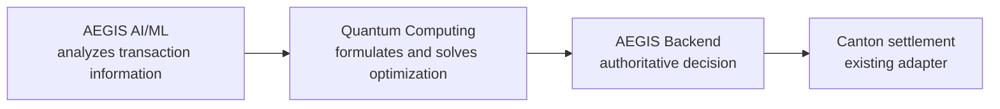

# AEGIS Quantum Computing Optimization Service

This isolated Python 3.12 service formulates and solves transaction/settlement route optimization problems for AEGIS. It is intentionally separate from `backend/`, `ai-ml/`, and `frontend/`. The service returns advisory results only; the AEGIS backend remains authoritative and no backend entities are mutated.

## What it does

Given a transaction amount and candidate routes with cost, risk, liquidity, capacity, and availability, the service selects a feasible route set and allocation that minimizes:

```text
sum_i x_i * (cost_weight * cost_i
           + risk_weight * transaction_amount * risk_i
           + selection_weight)
```

The same selection is checked against route-count, required-route, availability, capacity, liquidity, maximum-cost, and maximum-risk constraints.

## Formulation

Binary route variables are used:

```text
x_i = 1  route i is selected
x_i = 0  route i is not selected
```

`app/formulations/qubo.py` constructs an inspectable QUBO with:

- linear route objective terms;
- bounded binary slack registers for inequality constraints;
- deterministic penalty terms for infeasible selections;
- precision scaling for decimal financial values;
- an Ising conversion using `x_i = (1 + z_i) / 2`;
- metadata describing variables, terms, constraints, precision, and penalties.

The service does not claim that a classical heuristic is quantum execution.

## Solver architecture

`SolverInterface` is implemented by:

- `ClassicalSolver`: exhaustive enumeration for small instances and a deterministic beam-search heuristic for larger instances.
- `QuantumSimulatorSolver`: a local deterministic QAOA-like statevector simulation for small route sets, followed by an explicit classical feasibility decoder. Larger instances use a clearly labeled quantum-inspired classical fallback.
- `SolverRegistry`: selects the solver by name and leaves an adapter boundary for a future real-hardware backend.

No real quantum hardware is used in the default development environment. Simulator responses explicitly identify the local backend, algorithm, seed, shots, and fallback behavior.

## API

All endpoints except health checks require:

```text
Authorization: Bearer <QUANTUM_API_TOKEN>
```

- `GET /health`
- `GET /health/ready`
- `POST /formulate`
- `POST /optimize`
- `POST /compare`
- `GET /problems/{problem_id}`
- `POST /evaluate`

Responses use strict Pydantic schemas. Errors are structured as `{"error": {"code", "message", "request_id", "details"}}`; stack traces and bearer tokens are not exposed.

## Local setup

```bash
cd "quantum computing"
python -m venv .venv
.venv\Scripts\activate
pip install -r requirements.txt
copy .env.example .env
python -m app.main
```

The default development token is `dev-token`. Set `QUANTUM_API_TOKEN` to a real secret outside development.

## Environment variables

- `QUANTUM_API_TOKEN`
- `QUANTUM_SOLVER=classical|simulator|real_hardware`
- `QUANTUM_MAX_VARIABLES`
- `QUANTUM_TIMEOUT_SECONDS`
- `QUANTUM_MAX_PROBLEM_BYTES`
- `QUANTUM_HOST`
- `QUANTUM_PORT`
- `QUANTUM_ENVIRONMENT`
- `QUANTUM_QAOA_LAYERS`
- `QUANTUM_QAOA_ANGLE_GRID`
- `QUANTUM_QAOA_SHOTS`
- `QUANTUM_RANDOM_SEED`

## Testing and smoke test

```bash
pytest
python -m compileall .
python scripts/smoke.py --base-url http://127.0.0.1:8557
```

The evaluation suite includes deterministic, multi-route, capacity-constrained, risk-constrained, infeasible, invalid-input, duplicate-route, and larger-instance cases. Results are reproducible with a fixed seed.

## Limitations

- The default simulator is a local educational/evaluation simulator, not quantum hardware.
- Statevector simulation is intentionally limited to small route counts; larger requests use the labeled classical fallback.
- The in-memory store is process-local and is not a durable database.
- The beam search is a heuristic for large instances and does not guarantee a global optimum.
- Decimal values are scaled to a bounded precision before QUBO construction.

## Future integration

A real provider adapter can implement the existing solver boundary and populate provider, hardware backend, execution date, qubit count, shots, and execution metadata. Backend integration is intentionally deferred until this isolated service is stable.


